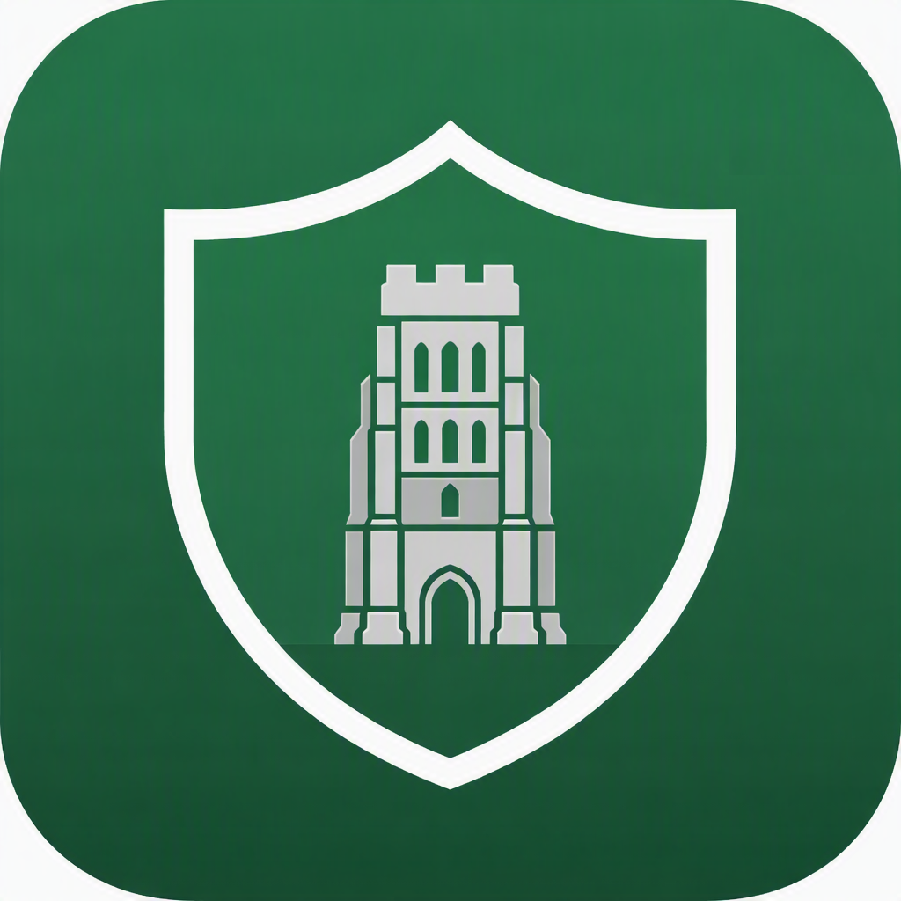

# Avalon Safe

### **Your private island for important documents.**

[English](README.md) · [简体中文](README.zh-CN.md)

---

## Overview

**Avalon Safe** is a privacy-first personal document manager for iOS.

It focuses on one simple thing:

> **Helping you securely store, organize, and quickly find the documents that matter most.**

Important documents are often scattered across paper files, drawers, photo libraries, downloads, and different folders — passports, IDs, contracts, certificates, insurance records, property documents, medical records, and more.

Avalon Safe aims to make managing them simple:

**Scan → Store → Find**

It is not a password manager, a cloud drive, or a place to store your entire digital life.

It is focused on one thing:

> **Important Documents.**

---

## The Name

In Arthurian legend, **Avalon** is a mysterious island hidden beyond the mist.

Often described as the Isle of Apples, Avalon is a place beyond the reach of ordinary people, watched over by magical guardians. It is associated with King Arthur, Excalibur, healing, and return.

**Avalon Safe** carries this idea forward.

It is not meant to feel like a cold, impersonal "digital vault."

Instead, it is a **private island of your own**:

> A private place for the documents you may not need every day, but will be very glad to have when you do.

That's the idea behind:

**Avalon Safe = Your private island for important documents.**

---

## Why Avalon Safe?

We believe important documents have two common problems:

### 1. Don't lose them

Many important documents still exist as paper — stored in filing cabinets, drawers, folders, or boxes.

When a document is lost, damaged, or needed while you're away from home, dealing with it can quickly become frustrating.

Avalon Safe makes it easy to digitize important paper documents and keep a secure copy close at hand.

### 2. Don't search everywhere when you need them

Often, the problem isn't:

> "I don't have the document."

It's:

> **"I know I have it. I just don't know where I put it."**

Avalon Safe gives important documents a clear, private, and organized place where they can be found when you need them.

Our goal is simple:

> **When a document matters, put it in Avalon Safe.**

---

## Core Experience

Avalon Safe is built around three simple actions:

### 📷 Scan

Use your iPhone to quickly capture and scan paper documents.

Turn important physical documents into digital ones.

### 🔐 Store

Keep documents in a privacy- and security-focused environment.

Avalon Safe supports **PDF** and **JPG**, keeping the product focused and intentionally simple.

### 🔎 Find

Organize and search your documents so you can quickly find what you need when it matters.

The experience:

> **Scan. Store. Find.**

---

## Inspiration & References

Avalon Safe's core experience is built around three areas:

**Capture & Scan → Encryption & Privacy → Document Management**

We look to three excellent open-source projects and products for technical and product inspiration, each representing a different part of the experience.

### 📷 Capture & Scanning — Open Scanner

[Open Scanner](https://github.com/pencilresearch/OpenScanner)

Avalon Safe draws inspiration from Open Scanner's approach to document capture, scanning, and digitization on iPhone.

We want the journey from a piece of paper to a digital document to be simple:

**Capture → Scan → Process → Save**

Open Scanner is an open-source document scanning project for iPhone and provides valuable reference for Avalon Safe's scanning and document digitization experience.

### 🔐 Encryption & Privacy — Cryptomator

[Cryptomator for iOS](https://github.com/cryptomator/ios)

Avalon Safe draws inspiration from Cryptomator's approach to **client-side encryption** and privacy-focused storage.

Important documents should not simply be "files in a folder." From the beginning, they should be treated as **private data that deserves protection**.

Areas we care about include:

* Privacy-first architecture
* Client-side encryption
* Clear security boundaries between data and keys
* Minimizing unnecessary reliance on third-party services

### 🗂️ Document Management — iOS Files

Avalon Safe draws inspiration from Sealby's approach to private file management, including folders, tags, organization, and search.

Avalon Safe is not intended to become a digital vault for everything. It is specifically focused on **important documents**.

We want documents to move naturally through:

**Organize → Sort → Find → Retrieve**

### Three Directions, One Experience

| Core Capability         | Reference    | Avalon Safe                                  |
| ----------------------- | ------------ | -------------------------------------------- |
| 📷 Capture & Scanning   | Open Scanner | Digitize physical documents                  |
| 🔐 Encryption & Privacy | Cryptomator  | Protect important documents and private data |
| 🗂️ Document Management | iOS Files       | Organize and quickly find documents          |

These projects are **inspiration and technical references for Avalon Safe, not products to be copied or bundled together**.

We hope to build our own experience on top of the ideas and lessons from these projects:

> **Scan. Store. Find.**

---

## What Can You Store?

Avalon Safe is designed for important documents that you may need to keep for years — documents that are difficult to replace, expensive to lose, or simply worth having when you need them.

### 1. Identity & Personal Records

Passports, national ID cards, driver's licenses, visas, residence permits, work permits, birth certificates, family records, legal name-change documents, proof of family relationships, background checks, and certificates of good conduct.

### 2. Property & Real Estate

Property deeds and title documents, purchase agreements, lease agreements, mortgage documents, homeowners or renters insurance records, property tax records, land records, closing documents, renovation contracts, official property records, title searches, and mortgage payoff or discharge statements.

### 3. Vehicles & Transportation

Vehicle titles and registration documents, driver's licenses, purchase agreements, auto insurance policies, warranty documents, inspection records, vehicle loans and financing documents, vehicle tax records, and loan payoff or release documents.

### 4. Marriage, Children & Family

Marriage certificates, divorce decrees or certificates, birth certificates, adoption records, custody and guardianship documents, family records, school enrollment documents, death certificates, and other important family records.

### 5. Education & Career

Diplomas, degree certificates, professional qualifications, training certificates, professional licenses, employment contracts, offer letters, professional credentials, certifications, and other important education or career records.

### 6. Medical & Health Coverage

Medical reports, medical certificates, health insurance documents, prescription records, vaccination records, medical receipts, important clinical records, hospital discharge summaries, maternity-related documents, and insurance reimbursement records.

### 7. Finance, Tax & Insurance

Insurance policies, tax documents, bank statements, investment records, loan agreements, pension and retirement documents, financial statements, proof of funds or deposit certificates, investment confirmations, trust agreements, and insurance cash value statements.

### 8. Legal & Agreements

Contracts, legal agreements, non-disclosure agreements, powers of attorney, wills, court documents, legal notices, settlement agreements, probate and inheritance documents, estate distribution agreements, patent certificates, trademark registrations, copyright registrations, and apostilles or consular legalization documents.

---

## Product Principles

### 🔒 Privacy First

Important documents are private data belonging to the user.

Security and privacy should be considered from the beginning of the product architecture, not added as an afterthought.

### 🎯 Focused on Important Documents

Avalon Safe is not trying to become:

* A password manager
* A cloud drive
* A private photo vault
* A notes app
* A personal finance app
* A digital vault for everything

It is focused on one thing:

> **Important Documents.**

### ✨ Simple by Design

We don't want to build a product overloaded with features.

Every feature — scanning, storing, organizing, and finding — should serve the core experience.

### 🏝️ Private & Reliable

Avalon Safe should feel like a private island of your own:

Quiet, simple, private — and reliable when you need to find something important.

---

## Roadmap

Avalon Safe is currently under active development.

Planned areas include:

* [ ] Document scanning
* [ ] PDF / JPG import
* [ ] Document organization and categorization
* [ ] Document search
* [ ] Secure local storage
* [ ] Document encryption
* [ ] Face ID / Touch ID
* [ ] More privacy-focused capabilities
* [ ] Better document processing

The roadmap will evolve as the project develops.

---

## Contributing

Avalon Safe is an open-source project and an ongoing exploration.

If you're interested in any of the following, we'd love to have you involved:

* iOS / Swift / SwiftUI
* Document scanning and image processing
* PDF / JPG document processing
* Local data storage
* Encryption and privacy
* Search and document management
* UI / UX
* Product design

Whether you'd like to contribute code, share ideas, improve the design, or report an issue, you're welcome to contribute to Avalon Safe.

> **Build a private island for important documents.**

---

## License

Avalon Safe is licensed under the **Apache License 2.0**.

You are free to use, modify, and distribute the software in accordance with the terms of the license.

See the [LICENSE](LICENSE) file for the full license text.

Copyright © 2026 Avalon Safe contributors.
